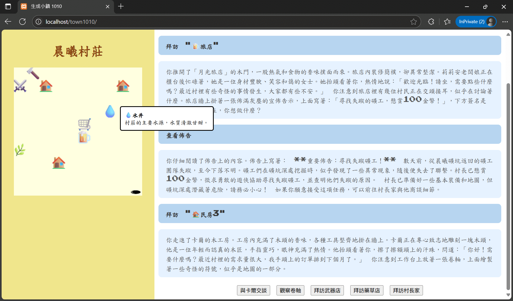

# 生成小鎮1010 - 用 Ollama 製作一個在本機執行的生成式文字冒險小遊戲



`生成小鎮 1010`是一個利用在本機執行的大語言模型，動態的生成遊戲地圖及根據玩家互動生成故事劇情及任務內容的文字冒險小遊戲。

完成環境建置後，就可以到 [Ollama 官網](https://ollama.com/) 下載模型，在本機開始測試遊戲。

```text
處理器(CPU) 13th Gen Intel(R) Core(TM) i5-13500H 2.60 GHz
記憶體(RAM) 40.0 GB
顯示卡 Intel(R) Iris(R) Xe Graphics 128 M
系統 Windows 11 家用版 24H2
```

這是我的筆電規格。在我的筆電上跑 [gemma3:4b-it-q4_K_M](https://ollama.com/library/gemma3) 模型，勉強可以玩。如果你有更強的硬體，就能夠利用更大的模型，得到更好的遊戲內容體驗。

gemma 是 Google 的開放的整合了視覺理解能力多模態大語言模型。4b: 是模型參數大小，表示 40 憶個參數。q4_K_M: 是一種減少模型大小和提高效率的技術，它涉及到將模型中的數值精度降低，並減少了對記憶體和計算資源的需求。

你也可以根據自己的需要或喜好，選擇下載不同模型。

## 1. 準備工作

### 1.1 什麼是 Ollama

Ollama 是一個可以在本機運行大型語言模型（LLM）如 LLaMA、Mistral、Gemma 等的開源工具。它的目的是讓開發者和使用者可以更輕鬆地在自己的電腦上執行和使用這些 AI 模型，而不需要依賴雲端服務。Ollama 的特點是：

- **本地運行模型**
你可以直接在 Windows、macOS 或 Linux 上下載並運行語言模型，無需連網使用 API。

- **簡單的 CLI 工具**
安裝後只需要輸入像 ollama run llama3 這樣的指令就可以開始對話。

- **支援多種模型**
包含 Meta 的 LLaMA、Mistral、Gemma、Deepseek 等模型，也可以自訂模型。

- **開發整合容易**
提供簡單的 API（RESTful），方便整合到你自己的應用程式、網頁或手機 App 中。

- **節省成本與提高隱私**
不用連接 OpenAI、Anthropic 或其他雲端 LLM，降低使用成本，也不會洩漏資料。

### 1.2 安裝 Ollama

訪問 [Ollama 官網](https://ollama.com/)，根據你的作業系統作安裝。安裝完成後，您可以使用以下命令來驗證 Ollama 是否安裝成功：

```bash
ollama --version
```

### 1.3 CLI 基本操作

Ollama 的 CLI 提供了一些基本操作，讓用戶能夠輕鬆管理模型。以下是一些常用的命令：

#### 1.3.1 下載模型

```bash
ollama pull <model_name>
```
這個命令會從 Ollama 的模型庫中下載指定的模型。

#### 1.3.2 運行模型

```bash
ollama run <model_name>
```
使用此命令可以啟動指定的模型並開始進行推理。

#### 1.3.3 列出已安裝的模型

```bash
ollama list
```
此命令會顯示您系統中已安裝的所有模型。

#### 1.3.4 刪除模型

```bash
ollama rm <model_name>
```
使用此命令可以刪除不再需要的模型。

其餘的命令可以由 ollama list 得到。

## 2. 串接 API 簡介

Ollama 提供了一個 RESTful API，讓開發者能夠輕鬆地與模型進行互動。以下是一些常用的 API 請求範例。

### 2.1 獲取版本

```bash
curl http://localhost:11434/api/version
```

這個請求將返回 API 的版本號，幫助您確認正在使用的 Ollama 版本。這個請求也可以用來確認本機上的 Ollama 正確安裝並在執行中。

## 2.2 生成聊天（串流）

```bash
curl http://localhost:11434/api/chat -d '{
  "model": "llama3.2",
  "messages": [
    {
      "role": "user",
      "content": "why is the sky blue?"
    }
  ]
}'
```

這個請求將使用指定的模型生成對於提示 "Why is the sky blue?" 的回應，並以串流的方式返回結果。沒有特別指定的話，串流模式是預設模式。

串流和非串流的差別是串流模式會把模型生成的內容逐步輸出給你，就像我們在網頁或 APP 上使用 ChatGPT 時，它的回答是逐字逐句跳出來的，這有助於提高使用者體驗。而不必像非串流模式要等待較長時間，等到全部結果生成後再一次整個跳出來。

我們在遊戲中生成對話內容時，會使用串流模式。

## 2.3 生成聊天（非串流）

```bash
curl http://localhost:11434/api/chat -d '{
  "model": "llama3.2",
  "messages": [
    {
      "role": "user",
      "content": "why is the sky blue?"
    }
  ],
  "stream": false
}'
```

這個請求將返回完整的生成結果，而不是逐步輸出。我們在遊戲中生成初始化地圖時，會使用非串流模式。

## 2.4 生成有前後文的聊天

你可以將多輪的歷史聊天訊息一起輸入，產生帶有前後文的聊天訊息。

```bash
curl http://localhost:11434/api/chat -d '{
  "model": "llama3.2",
  "messages": [
    {
      "role": "user",
      "content": "why is the sky blue?"
    },
    {
      "role": "assistant",
      "content": "due to rayleigh scattering."
    },
    {
      "role": "user",
      "content": "how is that different than mie scattering?"
    }
  ]
}'
```

後面我們會利用這個功能，把遊戲歷史記錄餵給 AI 作為輸入資料。

## 2.5 生成結構化輸出

為了有效控制模型的輸出資料格式，便於讓我們可以在程式裡面作後續的串接和處理，有必要控制生成資料的結構。

我們在網頁或 APP 上使用 ChatGPT 時，如果只靠提示來指令模型生成結構化資料的話，通常結果是不能保證的。而如果模型最後生出不符合我們需要的格式的資料的話，最終程式就會出錯。好在我們現在是直接串接 API，可以用更直接的方式控制輸出格式。

如下需要生成結構化的輸出，可以使用以下命令：

```bash
curl -X POST http://localhost:11434/api/chat -H "Content-Type: application/json" -d '{
  "model": "llama3.1",
  "messages": [
    {
      "role": "user",
      "content": "Ollama is 22 years old and busy saving the world. Return a JSON object with the age and availability."
    }
  ],
  "stream": false,
  "format": {
    "type": "object",
    "properties": {
      "age": {
        "type": "integer"
      },
      "available": {
        "type": "boolean"
      }
    },
    "required": [
      "age",
      "available"
    ]
  },
  "options": {
    "temperature": 0
  }
}'
```

這個請求將生成一個包含年齡和可用性狀態的 JSON 對象，並確保返回的結果符合指定的結構。

# 3. 關於角色 role 的定位及作用

在串接 API 時，`role` 指的是訊息在對話中扮演的角色，它決定了 AI 如何理解並回應你的提示。 理解 `role` 的定位和作用對於構建有效的對話至關重要。

## 3.1 System (系統角色)

`System` 角色是整個對話的起始點，定義了 AI 的行為、風格、知識範圍和任務目標。 你可以把它看作是「指令稿」。

### 3.1.1 作用

- **設定 AI 的行為:**  你可以在 `System` 角色中明確告知 AI 要扮演的角色，例如「你是一個友善的客戶服務代表」、「你是一個專業的編程助手」、「你是一個精通歷史的老師」。
- **設定 AI 的風格:**  你可以規定 AI 的回答應該是正式的、非正式的、幽默的、簡潔的等等。
- **設定知識範圍:**  你可以限制 AI 的知識範圍，例如「你只知道 2021 年之前的資訊」、「你只知道關於 Python 程式設計的知識」。
- **設定任務目標:**  你可以明確告訴 AI 要完成的任務，例如「你的任務是幫我整理一份旅遊行程」、「你的任務是幫我撰寫一篇產品描述」。
- **提示的初始設定:**  `System` 角色通常是整個對話的初始提示，它為後續的 `User` 和 `Assistant` 角色奠定基礎。

### 3.1.2 範例

```json
{
  "role": "system",
  "content": "你是一個優秀的程式設計師，專注於 Python。請用簡潔明瞭的方式回答問題。"
}
```

## 3.2 User (使用者角色)

`User` 角色代表你的提問、指令或輸入。

### 3.2.1 作用

這是你與 AI 互動的直接方式。 你的 `User` 訊息會觸發 AI 生成 `Assistant` 角色中的回應。

### 3.2.2 範例

```json
{
  "role": "user",
  "content": "如何用 Python 讀取 CSV 檔案？"
}
```

## 3.3 Assistant (助理角色)

`Assistant` 角色代表 AI 生成的回應。

### 3.3.1 作用

- **AI 的回應:**  AI 會根據 `System` 和 `User` 角色中的訊息，生成 `Assistant` 角色中的回應。
- **對話流程:** 透過交替的 `User` 和 `Assistant` 角色，AI 能夠模擬自然的對話流程。

### 3.3.2 範例

```json
{
  "role": "assistant",
  "content": "你可以使用 `csv` 模組來讀取 CSV 檔案。以下是一個範例：\n\nimport csv\n\nwith open('your_file.csv', 'r') as file:\n    reader = csv.reader(file)\n    for row in reader:\n        print(row)\n"
}
```

## 3.4 要點總結

- `System` 角色設定 AI 的背景和行為。
- `User` 角色代表你的輸入。
- `Assistant` 角色代表 AI 的輸出。
- 正確使用 `role` 能夠更好地控制 AI 的行為，提高對話的品質。

# 4. 生成地圖

現在我們要開始利用 AI 來生成遊戲地圖。基本概念是：我們要利用提示工程對 AI 下指令，讓它輸出我所期望的資料，也就是遊戲地圖。格式是一定要按照我的要求，至於內容則由 AI 自由發揮。

要生成地圖可以使用 generate 指令也能用 chat 指令，這裡我們使用的是 chat 指令，指定了兩條訊息。一條訊息的角色是 System，用來作模型角色定位。另一條訊息角色是 User，用來指示模型怎麼生成地圖。

## 4.1 生成地圖的提示工程

最初的提示如下:
```javascript
const create_town_system_prompt = `你是一個專業的遊戲設計師,你的任務是設計一個10x10的遊戲村莊.`;

const create_town_prompt =
`生成一個遊戲小鎮初始的建築物列表.村莊包含如下資料:
- name 村莊名稱
- description 村莊的說明
- buildings 建物列表

村莊裡有如下的建物:
- 一家旅店
- 一家雜貨店
- 可有可無的武器防具店
- 2、3家民房

每一個建物包含如下屬性:
- id 一個唯一數字
- name 建物的名稱
- description 一個簡介說明
- emoji 代表此建物的emoji
- x 建物的水平座標(0<=x<10)
- y 建物的垂直座標(0<=y<10)
`;

const create_town_messages = [
  {"role": "system", "content": create_town_system_prompt},
  {"role": "user", "content": create_town_prompt}
];
```

為了控制模型輸出資料格式，需要設定指令回應 format。

```javascript
const create_town_format = {
    "type": "object",
    "properties": {
        "name": {
            "type": "string"
        },
        "description": {
            "type": "string"
        },
        "buildings": {
            "type": "array",
            "building": {
                "type": "object",
                "properties": {
                    "id": { "type": "integer" },
                    "name": { "type": "string" },
                    "description": { "type": "string" },
                    "emoji": { "type": "string" },
                    "x": { "type": "integer" },
                    "y": { "type": "integer" }
                },
                "required": ["id", "name", "description", "emoji", "x", "y"]
            }
        }
    },
    "required": ["name", "description", "buildings"]
}
```

最後再整個串接起來，就可以生出地圖來。

```javascript
const input_data = {
    "model": model,
    "messages": create_town_messages,
    "format": create_town_format,
    "stream": false
};

fetch(`${api_base}/api/chat`, {
  method: 'POST',
  headers: { 'Content-Type': 'application/json' },
  body: JSON.stringify(input_data)
})
.then(response => response.json())
.then(data => {
  // Draw village.
})
.catch(error => {
  // Handle error.
});
```

注意這裡不用串流模式，所以 fetch 會等到模型一次把完整的資料傳來。得到的其中一個地圖資料如下:

```javascript
const villageData = `{
  "name": "橡木谷村 (Oakwood Hollow)",
  "description": "橡木谷村是位於繁茂森林邊緣的一個寧靜村莊，居民以農業和簡單的生活為生。在這裡，你可以品嚐到新鮮的農產品，感受淳樸的民風，但也要小心潛伏在森林中的危險。",
  "buildings": [
    {
      "id": 1,
      "name": "橡木旅店 (The Oakwood Inn)",
      "description": "村莊唯一的旅店，提供舒適的客房和美味的食物。老闆娘艾米莉亞是一位熱情好客的女士。",
      "emoji": "🏠",
      "x": 2,
      "y": 5
    },
    {
      "id": 2,
      "name": "好運雜貨店 (Lucky's General Goods)",
      "description": "村莊的雜貨店，出售各種必需品和一些稀有物品。老闆老約翰知道很多關於森林的故事。",
      "emoji": "🛒",
      "x": 7,
      "y": 2
    },
    {
      "id": 3,
      "name": "鐵匠鋪 (Blacksmith's Forge)",
      "description": "村裡的鐵匠巴克正在努力打造武器和防具，但資源匱乏，需要玩家協助。",
      "emoji": "🔨",
      "x": 9,
      "y": 7
    },
    {
      "id": 4,
      "name": "民房 - 艾倫一家 (Allen's Home)",
      "description": "艾倫一家是橡木谷村的居民，以種植蔬菜維生。他們友善而勤勞。",
      "emoji": "🏡",
      "x": 1,
      "y": 1
    },
    {
      "id": 5,
      "name": "民房 - 貝克一家 (Baker's Home)",
      "description": "貝克一家以烘焙美味的麵包和糕點而聞名。他們的香氣經常瀰漫在村莊的上空。",
      "emoji": "🏡",
      "x": 4,
      "y": 3
    },
    {
      "id": 6,
      "name": "民房 - 蓋洛德一家 (Gallord's Home)",
      "description": "蓋洛德一家是一群木匠，擅長製作家具和工具。他們在村莊中十分受人尊敬。",
      "emoji": "🏡",
      "x": 6,
      "y": 8
    },
    {
      "id": 7,
      "name": "民房 - 霍普金斯一家 (Hopkins' Home)",
      "description": "霍普金斯一家是村裡唯一的奶酪製造者，他們的奶酪在周圍地區都非常有名。",
      "emoji": "🏡",
      "x": 3,
      "y": 8
    },
    {
      "id": 8,
      "name": "民房 - 羅伯斯一家 (Roberts' Home)",
      "description": "羅伯斯一家是新搬到村裡的一家人，似乎在隱瞞著什麼...",
      "emoji": "🏡",
      "x": 8,
      "y": 4
    }
  ]
}`;
```

存起來後，就可以根據這個資料畫地圖了。

## 4.2 讓 AI 幫忙完善生成地圖的提示

雖然第一版的提示己經可以生成地圖了，但是還有改進空間。怎麼改進？這種事情就讓 AI 來作。再加上一些手動微調，最後得到的結果如下:

```javascript
const create_town_system_prompt = 
`你是一位經驗豐富的遊戲世界設計師，專長於創建引人入勝的 2D 遊戲地圖。
你的任務是設計一個 10x10 的遊戲村莊，它是一個"奇幻"風格的村莊。
地圖應考慮地形的變化和視覺層次的變化，使玩家在探索時有新鮮感。`;

const create_town_prompt = 
`根據系統指示，生成一個 10x10 遊戲村莊的初始建築物列表。
村莊包含以下資料：

- **村莊名稱:** （例如：晨曦村莊）
- **村莊說明:** （簡要描述村莊的背景和特色）
- **建物列表:** 至少包含一家旅店、一家雜貨店、1-3 家民房和一個武器店等等。

請確保：
- 所有建物不得重疊。
- 民房應分散在村莊的不同區域。
- 武器店應靠近村莊的入口。
- 旅店和雜貨店應位於村莊的中心。

每個建物包含以下屬性：
- **id:** 一個唯一的數字 (從 1 開始)
- **name:** 建物的名稱
- **description:** 一個簡要的說明, 可能包含裡面人物的簡介
- **emoji:** 代表此建物的 emoji (例如: 🏠, ⚔️, 🍺, 🕳)
- **x:** 建物的水平座標 (0 <= x < 10)
- **y:** 建物的垂直座標 (0 <= y < 10)

請注意，部分建物可能直接建造在山或山洞中。

**請確保：**
- 所有建物不得重疊。
- 民房應分散在村莊的不同區域。
- 武器店應靠近村莊的入口。
- 旅店和雜貨店應位於村莊的中心。
`;

const create_town_format = {
  "type": "object",
  "properties": {
    "name": { "type": "string" },
    "description": { "type": "string" },
    "buildings": {
      "type": "array",
      "items": {
        "type": "object",
        "properties": {
          "id": { "type": "integer" },
          "name": { "type": "string" },
          "description": { "type": "string" },
          "emoji": { "type": "string" },
          "x": { "type": "integer" },
          "y": { "type": "integer" }
        },
        "required": ["id", "name", "description", "emoji", "x", "y"]
      }
    }
  },
  "required": ["name", "description", "buildings"]
};
```

這裡面有個重點，用到一個叫作 In-context 的學習方式。這是一種提示工程的方法，即在模型中加入足夠多的背景知識或任務描述，以便進行預測。

通過提供上下文信息，模型可以更好地理解問題的內容，並生成更加合適的答案。這種方法能夠提高模型在特定任務上的表現，並減少誤差。

```text
Zero-shot：沒有給出任何範例參考，直接進行詢問。
user>翻譯以下文字成英文: 蘋果 =>

One-shot：提供一個範例。
user>翻譯以下文字成英文: 香蕉 => banana, 蘋果 =>

Few-shot：提供多個範例。
user>翻譯以下文字成英文: 香蕉 => banana, 橘子 => orange, 蘋果 =>
```

透過這種引導方式，我們可以在大型模型上獲得驚人的效果（小型模型則無法達到這種效果）。


# 5. 遊戲互動

處理玩家和遊戲互動推進遊戲的基本概念是：當玩家點擊地圖上的某建物時，就產生一條"拜訪某某某"的聊天訊息，串接在遊戲互動的系統提示及前面己進行的遊戲歷史記錄之下，讓 AI 接著生成回應。

## 5.1 遊戲互動的提示工程

第一個版本的提示工程如下:

```javascript
const game_system_prompt =
`你是一個專業的遊戲設計師,你的任務是設計在一個10x10的遊戲村莊裡的遊戲劇情及任務:
- 你會根據遊戲歷史記錄動態創造新的劇情及任務
- 你會根據遊戲小鎮裡的風土人物創造合適的劇情及任務
`;

const play_game_prompt = 
`遊戲進行方式是:
- user要求跟某人對話,你產生對應的結果.說明當前故事、劇情、任務或提示user下一步該怎麼作,應該找誰.
- 如果user要求跟某人對話,此人是下一個正確的人則推進劇情,否則繼續下一個故事、劇情、任務或提示user下一步該怎麼作.
`;

const play_game_format = {
    "type": "object",
    "properties": {
        "name": { "type": "string" },
        "response": { "type": "string" }
    },
    "required": ["name", "response"]
};

function constructPlayGameInputData(npc) {
  const play_game_messages = [
    {"role": "system", "content": game_system_prompt},
    {"role": "assistant", "content": play_game_prompt}
  ];
  return {
    "model": model,
    "messages": play_game_messages.concat(game_history),
    "format": play_game_format,
    "stream": false};
}
```

點擊地圖上的建物時，呼叫 talkToNpc 就能根據目前遊戲狀態讓模型產生合適的回應推進遊戲。

```javascript
function talkToNpc(npc) {
  appendHistoryItem({'role':'user','content':`talkToNpc:${npc}`});
  const inputData = constructPlayGameInputData(npc);
  fetch(`${api_base}/api/chat`, {
    method: 'POST',
    headers: { 'Content-Type': 'application/json' },
    body: JSON.stringify(inputData)
  })
  .then(response => response.json())
  .then(data => {
    appendHistoryItem({'role':'assistant','content':data.message.content});
  })
  .catch(error => {
    // Handle error.
  });
}
```

## 5.2 改良模型回應

回應裡面應包含關於"拜訪某某某"所產生的反應結果，以及一組建議玩家的下一步行作或操作。

第一步先把 talkToNpc 改為 performAction，預留為以後作為更通用的執行動作。

```javascript
function performAction(action) {
  appendHistoryItem({'role':'user','content':`Your action: ${action}`});
  // 以下同上面的 talkToNpc 內容.
}
```

遊戲互動的模型回傳格式改成如下，新增 next_actions。

```javascript
const play_game_format = {
    "type": "object",
    "properties": {
        "action": { "type": "string" },
        "result": { "type": "string" },
        "next_actions": {
            "type": "array",
            "next_action": { "type": "string" }
        }
    },
    "required": ["action", "result", "next_actions"]
}
};
```

next_actions 是一個陣列，所以模型可能傳回多個下一步操作。收到回應後，就能把 next_actions 作為一個選單選項都顯示出來，讓玩家作選擇。當玩家選取某一選項時，則呼叫 performAction 推進模型產生下一步回應。

## 5.3 處理串流回應提高使用者體驗

如果串 API 是為了作在背景執行的工具或服務，那麼就不必管使用者體驗的問題。

但若作為一個有使用者介面的應用的背景服務，如果每次使用者下個指令，就要等待一段較長時間後整個結果才跳出來。跟每次下完指令後等待一段較短時間後，結果就不斷的一個一個跳出來。這兩種處理方式，帶給使用者的體驗就完全不同。

所以接下來，我們要作的是把遊戲互動的回應改為串流模式，以增加使用者體驗。要作到這件事，有兩個地方要修改。

第一個很簡單，把 constructPlayGameInputData 裡面的 "stream": false 拿掉即可變為串流模式。第二個修改較麻煩，要修改 performAction 為可以處理串流回應。

串流模式回傳的資料結果可能如下:
```json
{"model":"gemma3:4b-it-q4_K_M","created_at":"2025-06-13T01:01:46.2135619Z","message":{"role":"assistant","content":"Okay"},"done":false}
{"model":"gemma3:4b-it-q4_K_M","created_at":"2025-06-13T01:01:46.3280286Z","message":{"role":"assistant","content":","},"done":false}
{"model":"gemma3:4b-it-q4_K_M","created_at":"2025-06-13T01:01:46.4407359Z","message":{"role":"assistant","content":" let"},"done":false}
{"model":"gemma3:4b-it-q4_K_M","create
```

他是由許多個小塊的回應組成，每一小塊回應都是一個 JSON 格式的資料，我要需要把裡面的 content 都抓出來組成一個大塊的完整資料。

每處理一小塊的 content 時，就可以同時把這一小塊的 content 顯示到畫面上，這樣就能讓使用者不斷的看到畫面變化，減少長時間等待的不適感。

```javascript
const reader = response.body.getReader();
const decoder = new TextDecoder();
let done = false;
let textChunk = '';

while (!done) {

  ...

  textChunk += decoder.decode(value);

  // 假設各別的 JSON 物件是以 '\n' 分隔.
  const matches = textChunk.split('\n');

  let part_content = '';
  for (let i = 0; i < matches.length; i++) {
    try {
      const json_response = JSON.parse(matches[i]);
      const this_content = json_response.message.content;
      part_content += this_content;
      if (json_response.done) {
        done = true;
        break;
      }
    } catch (error) {
      // Handle error.
    }
  }

  // Output part_content.

  ...
}
```

上面的處理作了一個假設，它假設回傳的許多個各別的 JSON 物件是以 '\n' 分隔開的。因為作了這個假設的處理比較簡單，目前這樣的處理是可以的。正確的作法是要解析 textChunk 並找出每一塊 JSON 物件來，才能保證未來不會出錯。

另一個作法是，把整塊 textChunk 丟給模型去分塊，充分利用模型的文字解析能力。當然，這會有額外開銷。

## 5.4 讓 AI 幫忙完善遊戲互動的提示

最後一樣讓 AI 幫忙完善一下遊戲互動的提示。加上一些手動微調後的結果如下:

```javascript
const game_system_prompt =
`你是一位經驗豐富的遊戲劇情設計師，專注於創建引人入勝的 2D 遊戲劇情。
你的任務是動態創造新的劇情及任務，確保劇情與歷史記錄和村莊資訊相符。
請注重劇情的可玩性和沉浸感。
`;

const play_game_prompt = 
`遊戲進行方式是:
- User 要求與某人對話。
- 你必須根據當前的遊戲歷史、村莊資訊和對話目標，產生合適的回應。
- 回應內容應包含當前故事、劇情、任務或提示 User 下一步該怎麼作，應該找誰。
- 如果 User 要求與某人對話，且此人是推進劇情所必需，則推進劇情；否則，繼續設計新的故事、劇情、任務或提示 User 下一步該怎麼作。

你的回應 JSON 格式應該如下：
{"result": "你的回應", "next_actions": ["下一個動作1", ...]}
`;
```

# 6. 總結

這是一個利用大語言模型的生成能力作出來的小遊戲，還有很多改進空間。 例如:

- 完善建築物及 NPC 的屬性，加上'角色定位'、'目前任務'、'關係屬性'等等，會讓模型的生成結果有更微妙的不同。
- 加入背包系統，可以讓遊戲更多互動變化。
- 前面提到的 performAction 的串流處理的改進。

經由這個小遊戲，對於怎麼串接大語言模型 API 來製作應用，相信對大家有一個更明確的概念。
